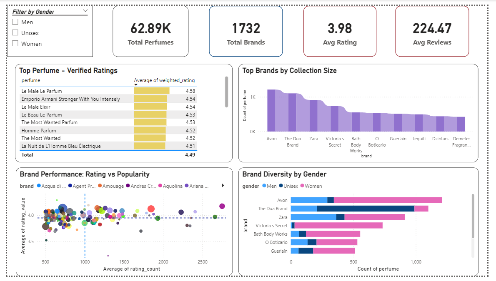

# Luxury-Fragrance: Sensory Data & Consumer Insights Impact:
Consumer Preference Analysis: Impact of Olfactory Notes on Product Rating
# 🌸 Decoding the Fragrance Market: Consumer Preference Analysis

[cite_start]**Domain:** E-commerce Market Research & Competitor Analysis [cite: 78]

 

## 1. Project Overview
The global fragrance market is saturated with thousands of scents. This project doesn't just look at what sells; it dissects **why** it sells[cite: 79, 81]. By reverse-engineering community reviews from a dataset of over 70,000+ validated perfumes, this project uncovers the hidden correlations between scent profiles (accords) and true consumer consensus[cite: 82, 85].

## 2. Tech Stack & Architecture
This project demonstrates an end-to-end data pipeline:
* [cite_start]**Python (Data Engineering - Pandas, NumPy):** Cleaned unstructured scraped data, utilized Regex to extract accurate brand names, un-nested stringified arrays for olfactory notes, and handled missing values through strategic imputation[cite: 86, 93, 95, 97, 104]. [cite_start]Reduced data size from ~70k noisy records to ~63k validated entries[cite: 107].
* [cite_start]**SQL Server (Statistical Modeling):** Solved the "Rating Bias Dilemma" (where niche products with 5 votes outrank popular items) by engineering a **Weighted Rating Model** inspired by IMDb's Bayesian ranking[cite: 87, 111, 115, 117]. [cite_start]Encapsulated logic into a live SQL View `dbo.perfume_weighted`[cite: 124].
* [cite_start]**Power BI (Data Visualization):** Built an executive-ready, interactive decision-support dashboard highlighting macro market structures and micro-level product performance[cite: 88, 133, 136, 137].

## 3. Key Business Discoveries ("Aha!" Moments)

### 💡 Insight 1: The "Fresh" Illusion vs. The "Warm" Reality (Quantity vs. Quality)
[cite_start]At first glance, the market appears dominated by Fresh and Citrus fragrances purely by production volume[cite: 140]. [cite_start]However, deeper SQL analysis revealed that fragrances built around warmer, complex accords—such as **Vanilla, Amber, Tobacco, Oud, and Warm Spices**—consistently achieved the highest weighted ratings[cite: 141]. 
[cite_start]*👉 **Takeaway:** Fresh scents dominate volume, but richer compositions dominate consumer appreciation[cite: 142].*

### 🏆 Insight 2: The True Consumer Consensus Leaderboard
[cite_start]By applying the Weighted Rating model to filter out artificially inflated scores, the revised rankings surfaced a different reality[cite: 144]. [cite_start]The true top performers (e.g., *Le Male Le Parfum, Stronger With You Intensely, Spicebomb Extreme*) all share a common denominator: **A refined balance of sweet, spicy, and warm woody bases**[cite: 145, 146].

## 4. Business Impact
[cite_start]For a fragrance house or e-commerce platform, insights like these help move beyond launching yet another generic citrus cologne, toward formulating fragrances with stronger potential for high ratings and lasting consumer appeal, specifically focusing on rich amber-vanilla compositions[cite: 148].
